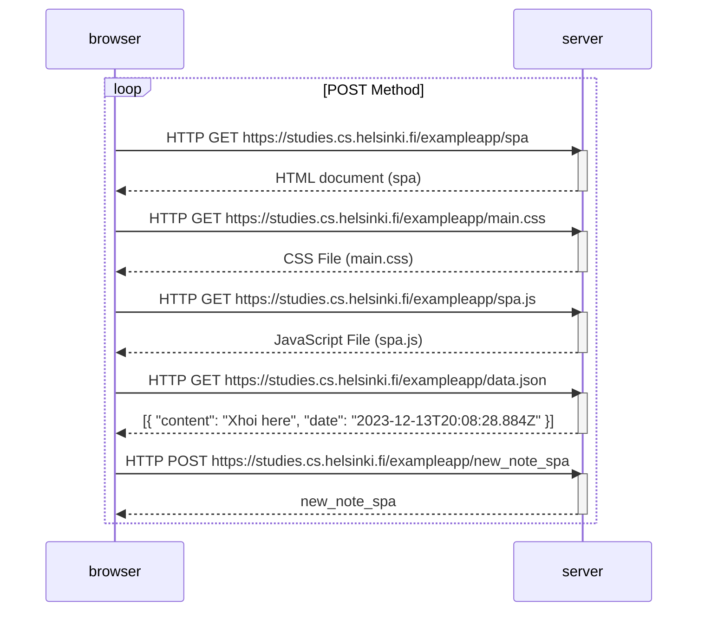

# 0.6-new-note in-single-page-app-diagram

```mermaid

sequenceDiagram
participant browser
participant server

    loop POST Method
        browser->>server: HTTP GET https://studies.cs.helsinki.fi/exampleapp/spa
        activate server
        server-->>browser: HTML document (spa)
        deactivate server

        browser->>server: HTTP GET https://studies.cs.helsinki.fi/exampleapp/main.css
        activate server
        server-->>browser: CSS File (main.css)
        deactivate server

        browser->>server: HTTP GET https://studies.cs.helsinki.fi/exampleapp/spa.js
        activate server
        server-->>browser: JavaScript File (spa.js)
        deactivate server

        browser->>server: HTTP GET https://studies.cs.helsinki.fi/exampleapp/data.json
        activate server
        server-->>browser: [{ "content": "Xhoi here", "date": "2023-12-13T20:08:28.884Z" }]
        deactivate server

        browser->>server: HTTP POST https://studies.cs.helsinki.fi/exampleapp/new_note_spa
        activate server

        server-->>browser: new_note_spa
        deactivate server

    end
```
